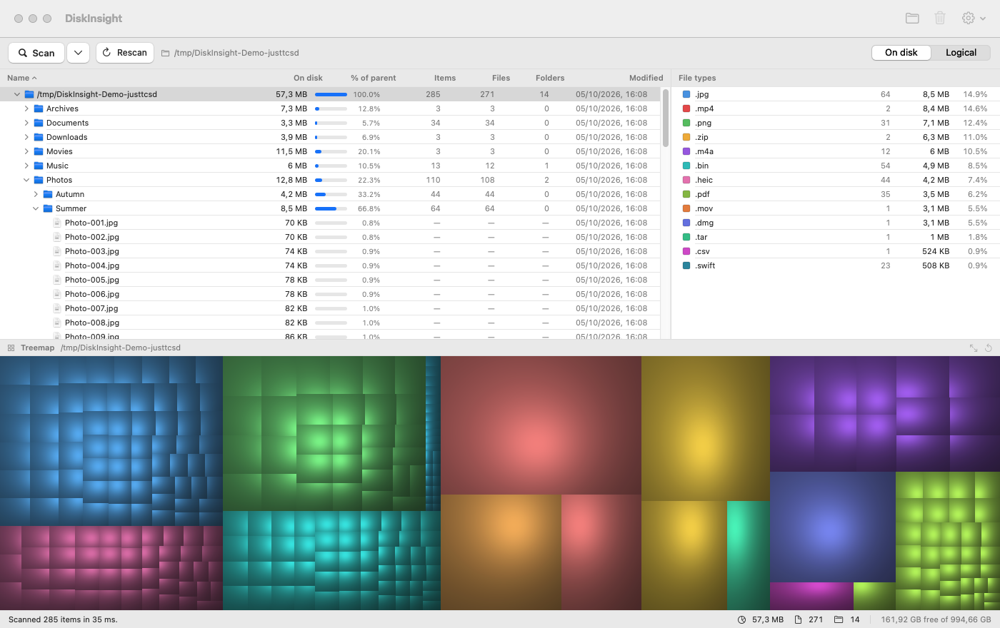
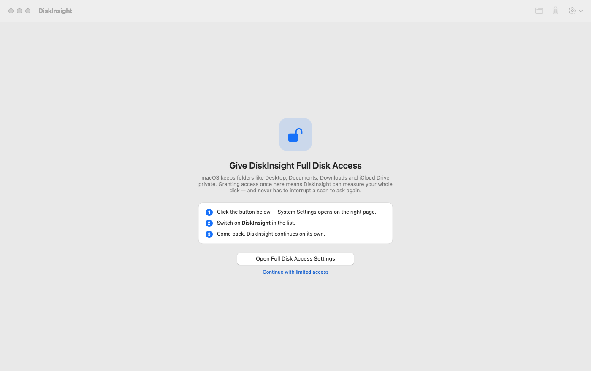

# DiskInsight

A native macOS disk usage analyser inspired by **WinDirStat**. Explore your disk
with a linked directory tree, file-type breakdown, and cushion treemap, then
move unwanted files to Trash. Built with SwiftUI and AppKit.

**macOS 14+ · Apple Silicon · No third-party dependencies · [MIT licensed](LICENSE)**

## Install

```bash
brew install --cask fvandillen/tap/diskinsight
open -a DiskInsight
```

Or download the ZIP from
[GitHub Releases](https://github.com/fvandillen/diskinsight/releases/latest),
unzip it, and drag **DiskInsight.app** into **Applications**. Releases support
Apple Silicon only.

**First launch:** releases are ad-hoc signed, not notarized. If macOS blocks the
app, attempt to open it, then select **System Settings → Privacy & Security →
Open Anyway**. Only approve a download you trust; do not disable Gatekeeper.

Upgrade or uninstall:

```bash
brew upgrade --cask diskinsight
brew uninstall --cask diskinsight
```

## Screenshots





## Quick start

1. Grant **Full Disk Access**, or choose **Continue with limited access**.
2. Click **Scan** to choose a folder or volume.
3. Select a tree row, file type, or treemap block to explore its disk usage.
4. Reveal files in Finder, or press **⌘⌫** to move a selection to Trash after
   confirmation.

Scanning stays local; no file listings are uploaded.

## Features

* **Sortable directory tree** with sizes, percentages, item counts, and dates.
* **Ranked file types** with colour-coded treemap highlighting.
* **Cushion treemap** sized by file usage; double-click to zoom in.
* **Move to Trash** with confirmation and immediate updates to all views.
* **Reveal, open, and copy paths** from the toolbar or context menu.

Selections are linked across all three views.

## Permissions

DiskInsight requests **Full Disk Access** on first launch to include protected
user data without repeated folder prompts. With **Continue with limited access**,
guarded folders are skipped, shown as locked, and excluded from totals.

Full Disk Access does not override every macOS protection or file permission.
Inaccessible items are marked inline in the directory tree, without a warning
banner. A neutral **macOS-protected** count records Data Vaults and known
system-managed access denials. Omitted contents remain excluded from totals;
DiskInsight does not elevate privileges.

Use `--list-unreadable` for up to 100 affected paths and filesystem errors.
An unreadable scan root fails explicitly rather than showing an empty scan.

## Build and install

```bash
./Scripts/build_app.sh             # -> build/DiskInsight.app
./Scripts/build_app.sh --install   # also copies to /Applications
```

Requires macOS 14+, Apple Silicon, and Xcode command line tools
(`xcode-select --install`). The script builds and ad-hoc signs an `arm64` app.

See [CONTRIBUTING.md](CONTRIBUTING.md) for development and tests, and
[the release guide](docs/releasing.md) for packaging and Homebrew updates.

## Performance

Example startup-volume scan on Apple Silicon; results vary by machine:

| Metric | Value |
| --- | --- |
| Items | 3,008,021 files / 656,970 folders |
| Total measured | 735 GB |
| Wall clock | ~21 s (cold), ~1 s for a small tree warm |
| Peak memory | ~620 MB |

## How the scan works

* Parallel filesystem traversal using `opendir` and `fstatat`.
* Firmlinks are followed; directories are de-duplicated by device and inode.
* Hidden helper volumes, network mounts, and autofs are skipped.
* Cloud placeholders are not opened, avoiding downloads.
* Symbolic links are not followed; hard links are counted separately.

### Size on disk vs logical size

**Size on disk** measures allocated blocks (0 for cloud-evicted files);
**Logical size** measures file length. Scan progress uses the selected size mode;
`--verbose` reports size on disk. Sparse files and cloud placeholders can have
logical sizes larger than the disk's capacity. Neither guarantees reclaimable space:
hard links, APFS clones, and snapshots can share or retain data. Space is not
freed by moving files to Trash until you empty it.

## Command line

Homebrew also installs the `diskinsight` command:

```bash
diskinsight --scan ~/Downloads --top=20
diskinsight --scan / --png=/tmp/map.png --verbose
```

Without Homebrew, use `/Applications/DiskInsight.app/Contents/MacOS/DiskInsight`
instead of `diskinsight`. Full Disk Access for headless use can also depend on
the terminal app launching the process.

| Flag | Meaning |
| --- | --- |
| `--scan <path>` | print the largest entries and file types, then exit |
| `--top=N` | how many rows to print (default 20) |
| `--png=<file>` | also write a 1600×900 treemap image |
| `--verbose` | live progress while scanning |
| `--cross-volumes` | follow mount points onto other volumes |
| `--list-blocked` | list folders skipped for permissions |
| `--list-unreadable` | show up to 100 unexpected read failures with paths and causes |
| `--probe-paths` | probe guarded locations; may trigger permission prompts |

## Keyboard shortcuts

| Shortcut | Action |
| --- | --- |
| ⌘O | Scan a folder… |
| ⌘R | Rescan |
| ⌘⌫ | Move selection to Trash |
| ⇧⌘R | Show in Finder |
| ⇧⌘C | Copy path |
| ⌘[ / ⌘] | Treemap zoom out / whole tree |

## Contributing and license

Contributions are welcome; see [CONTRIBUTING.md](CONTRIBUTING.md).
Report bugs in [GitHub issues](https://github.com/fvandillen/diskinsight/issues).

Copyright © 2026 Florian van Dillen. Released under the [MIT License](LICENSE).
Not affiliated with WinDirStat.
